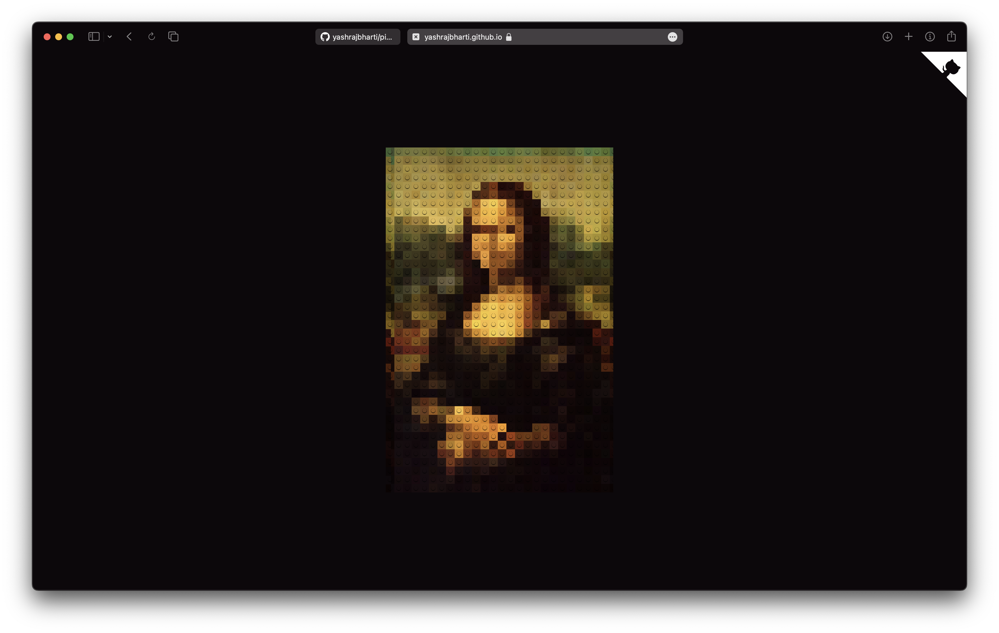

# Image-Pixelated Web Component

The **`<image-pixelated>`** web component allows you to pixelate images effortlessly and provides an optional Lego effect for a fun, grid-style overlay. The component is fully responsive and highly customizable with attributes for pixel size, grid size, maximum dimensions, and more.



---

## Features

- **Pixelation**: Pixelates the image using a customizable grid size.
- **Lego Effect**: Adds an optional Lego-style grid overlay for visual enhancement.
- **Responsive Design**: Automatically scales to fit the specified dimensions while maintaining the aspect ratio.
- **Customizable Attributes**: Control pixel size, Lego grid size, maximum dimensions, and enable/disable effects dynamically.
- **Accessible**: Includes ARIA attributes for better screen reader support.

---

## Installation

[NPM link for Pixelate package](https://www.npmjs.com/package/image-pixelate)

Simply use npm or unpkg to install:

```bash
npm install image-pixelate
```

```html
<script src="https://unpkg.com/image-pixelate@2.0.0/js/pixelate.js"></script>
```

then import using:

```js
import "image-pixelate";
```

---

## Usage

Simply use as web components:

```html
<image-pixelated
    src="./Mona_Lisa.jpg"
    pixel-size="15"
    lego-size="15"
    max-width="500"
    max-height="600"
    lego-effect="true"
></image-pixelated>

<image-pixelated
    src="./Mona_Lisa.jpg"
    pixel-size="15"
    max-width="500"
    max-height="500"
></image-pixelated>
```

---

## Attributes

| Attribute      | Type    | Default Value | Description                                                                                         |
|----------------|---------|---------------|-----------------------------------------------------------------------------------------------------|
| `src`    | String  | `null`        | The URL of the image to pixelate.                                                                  |
| `pixel-size`   | Number  | `10`          | The size of each pixel in the grid. A higher number results in larger pixels.                      |
| `lego-size`    | Number  | `10`          | Controls the size of the Lego grid cells. This attribute works only when `lego-effect` is enabled. |
| `max-width`    | Number  | `500`         | The maximum width (in pixels) for the image.                                                       |
| `max-height`   | Number  | `500`         | The maximum height (in pixels) for the image.                                                      |
| `lego-effect`  | Boolean | `false`       | Enables the Lego grid overlay effect.                                                              |

---

## How It Works

1. **Image Loading**:
   - The component loads the image from the `src` URL.
   - If the image exceeds the specified `max-width` or `max-height`, it scales down while maintaining the aspect ratio.

2. **Pixelation**:
   - The `pixel-size` attribute determines the size of each pixel block.
   - Pixel data is extracted using the `canvas` API and redrawn as larger pixel blocks.

3. **Lego Effect**:
   - When `lego-effect` is enabled, a grid-like overlay is added using a background image (`circle.png`) sized according to the `lego-size` attribute.

> [!NOTE]
> Using the `lego-effect` set to `true` is important and the `lego-size` attribute will have no effect on the component without it.

---

## Error Handling

If the `src` fails to load:

- A placeholder gray canvas is displayed.
- An error message ("Image failed to load") is added to the canvas for better user feedback.

---

## Accessibility

- The canvas includes a `role="img"` attribute and an ARIA label (`aria-label`) describing the pixelated image.

---

## Contributing

If you'd like to contribute:

1. Fork the repository.
2. Make your changes.
3. Submit a pull request.

We welcome enhancements and new features!

---

## License

This project is licensed under the MIT License. See the `LICENSE` file for details.
